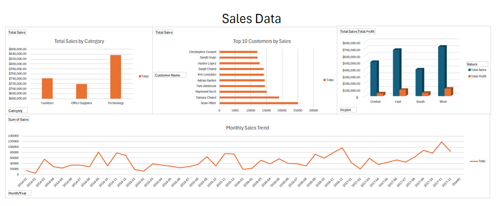

# Superstore-Portfolio-Project

## Project Overview
This project explores sales and profit trends from the **Superstore dataset (2014–2017)** to identify key insights across regions, products, and customers.  
It was completed using **Excel** for dashboard visuals and **SQLite (DB Browser)** for SQL analysis.

##  Tools Used
| Tool | Purpose |
|------|----------|
| **Excel** | Interactive sales dashboard & charts |
| **SQLite / DB Browser** | SQL queries for trend and performance analysis |
| **GitHub** | Portfolio hosting & version control |

## Analysis Highlights
- Sales by Category  
- Sales by Region
- Top 5 Customers by Region
- Top 10 Customers by Sales

## Results Summary
- Technology had the top sales by quite a large margin.
- The West region had the top sales.
- the top 5 customers in each region make up 60% of the total sales.

## Links

## Next Steps

- Build a **Tableau dashboard** from the same dataset.  

